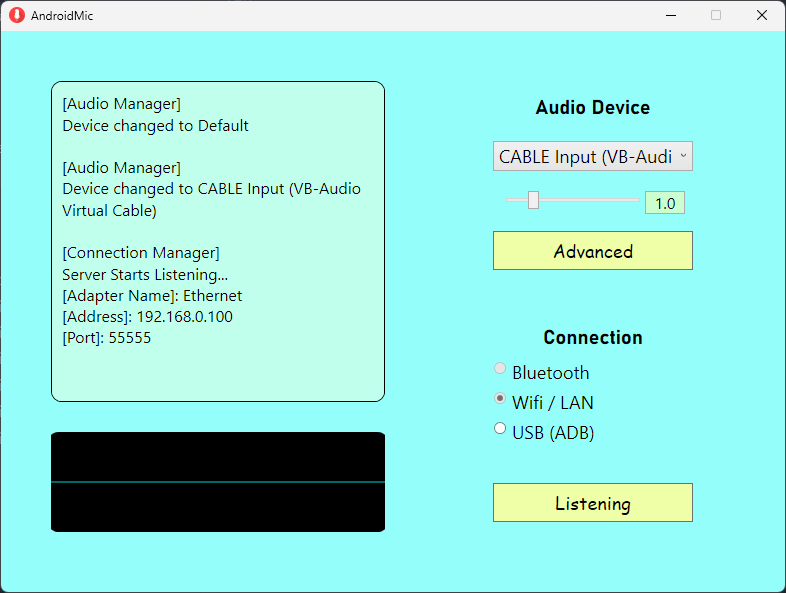

# Android Microphone

Use your Android phone as a microphone to Windows PC

__Idea__  
You have a Windows desktop PC but do not have a mic (or have a Sony bluetooth headset whose mic cannot be detected by Windows like me), you may need to buy a new cabled headset with a mic. However, you also have an Android phone which you use to chat with your friends everyday. So, why not use your Android phone as a mic for your PC?

------

### Requirements  
* Android phone with bluetooth  
* Windows PC with bluetooth  
* PC and phone are paired once  
* Installed [Virtual Audio Cable (VAC)](https://vac.muzychenko.net/en/) on Windows, will hear "trial" voice if your driver is in trial mode  
  I'm actually using [VB-Audio](https://vb-audio.com/Cable/) as alternative now since it is completely free  

------

### How to use  

1. Run Windows side application first, click `connect` to start server  
2. Next launch Android side application, click `connect` and enable `microphone`  
3. Select audio speaker from drop down list to the one that VAC (or VB) created  
     
4. Use the corresponding microphone created by VAC (or VB)  
     

That's all!  

------

### Future Feature Plan  

- [x] Windows app can minimize to system tray  
- [x] Volume control on Windows side  
- [x] Audio visualization on Windows side  
- [x] USB serial port connection support  
- [ ] Make Android side able to run in background  
- [ ] Show notification when mic is in use on Android side  

------

### Releases

Pre-built installers can be found [here](https://github.com/teamclouday/AndroidMic/releases)  

------

### Windows Side

### Android Side

------

### USB Communication

This branch contains an implementation of communication between Windows app and Android app through USB cable, based on `adb` tcp forwarding. Android side acting as a TCP server, and Windows side as a TCP client.  

However, this method requires Android phone to be in USB debugging mode.  
Socket communication is also wierd because of the forwarded connection. For example, when Android side has not started, Windows side will still be able to read stream (0 byte however) because a forwarded port is enabled. But when Android side is started and Windows side has connected, if Android side do not send data, Windows side will regard it as a timeout (no longer reading 0 byte). This problem makes things difficult. As an alternative solution, I have to reset connection and try to connect again every 1 second. This works but leave a messy log message interface to user.  

With that said, this branch contains a working solution, as long as USB debugging is enabled and you can bear with the messy log message!